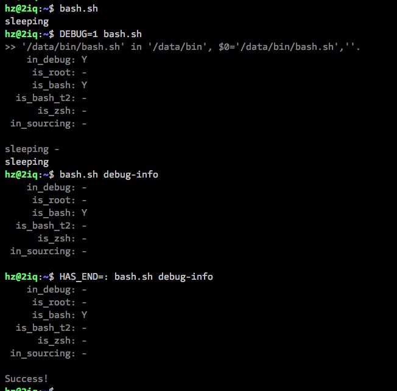

# bash.sh

`bash.sh` is a starting template for shell developing.

## History

- v20230111:
  - improved `_my_main_do_sth`
  - fixed test for `HAS_END` and `VERBOSE`
  - added `tip`, `err`, and `pad`
  - fixed `fn_name/_dyn` in mac
  - added `in_provisioning` stub codes
  - more improvments and bug fixes

- v20230109:
  - fixed checker by setting `HAS_END=1`
  - added `pad()`: usage like `cat 1.txt|pad 4`

- v20230108:
  - add comment for HAS_END testing at ending of the whole provisioning script:
    > Why use `{ [ $# -eq 0 ] && :; }`?
    >   While bash.sh/provision.sh/ops was been invoking with command-line args,
    >   we would assume that's normal status if `trap` caluse doesn't catch any errors.
    >   So, a failure test on HAS_END shouldn't take bad effect onto the whole provisioning script exit status.
    > You might always change this logic or comment the following line, no obsezzing on it.
    > Or, if your provisioning script with bash.sh has not any entranance arguments,
    > disabling this logic is still simple by defining HAS_END=1.
  - added new file `after.sh.sample`;
  - fixed the location testing of `after.sh`

- v20230107:
  - added in_vm, lsb_release_cs, uname_kernel;

- v20230104:
  - add'd: strip_l, strip_r
  - imp'd: make `commander` fit for zsh too

- v20230101:
  - load after.sh; imp: load_import_files & load_files
  - added into tool.sh: zsh_theme, realod_zsh_autocomp, ..., print_path, print_fpath

- v20221217:
  - imp'd, comments

- v20221104:
  - added: `url_exists`, `git_clone`

- v20221027:
  - imp'd: fixed `realpathx()` under macOS

- v20221021:
  - added: `default_dev`, `netmask`, `gw`, `lanip`, 'lanip6', `wanip`, `wanip6`, ...
  - imp'd: fixed `realpathx()` under macOS

- v20221020:
  - bash.sh use bump() to upgrade the release now
  - imp'd: fixed `realpathx()` under macOS

- v20221019:
  - added: `BASH_SH_VERSION`(=`v20221019`,...)
  - imp'd: better `realpathx()` under macOS
  - imp'd: solved `$SCRIPT` and `$CD` if the script is a symbolic link itself.

- v20220911:
  - fixed: `in_sourcing' under zsh

- v20220909:
  - fixed: `in_sourcing',`is_bash`,`in_jetbrain`

- v20220908:
  - fixed: `debug_info` cannot print '-' sometimes, replace with '.'
  - fixed: `in_sourcing',`is_bash`,`in_jetbrain`
  - improved: bash.config can be directly sourced in from .zshrc

- v20220822:
  - fixed: `is_git_dirty`, added `is_git_clean`
  - updated: bash-lite.sh

- v20220807:
  - imp'd/fixed: dbg the warnings in `load_import_files`/`load_env_files`
  - imp'd: safer `is_zsh`
  - added: `is_win` (=`in_wsl`)
  - added: `in_vscode`, `in_jetbrains` (for clion/goland/...)
  - imp'd: disable stdout for testing by `fn_exists`/`fn_builtin_exists`/`fn_aliased_exists`
  - imp'd: better `debug_info`
  - imp'd: beeter `main_do_sth`

- v20220516:
  - improved/fixed: adapted into vagrant better

- v20220513:
  - improved/fixed: osid, is_debian_series, ...
  - added: osidlike, oscodename, ...
  - fixed: fn_exists
  - added: load_import_files && load_env_files to load and source extra files
  - more...

- ...
- 20190215
- 20180509
- ...

## Usages

### Command Line Options

```bash
# internal commands
$ ./bash.sh cool
$ ./bash.sh sleep

# see debug-info (environment checks)
$ DEBUG=1 ./bash.sh
$ ./bash.sh debug-info

# internal helpers
$ ./bash.sh 'is_root && echo Y'
$ sudo ./bash.sh 'is_root && echo Y'
$ sudo DEBUG=1 ./bash.sh 'is_root && echo y'

# at end of the execution
$ HAS_END=: ./bash.sh
$ HAS_END=false ./bash.sh
```

### Use It

#### 1. Simple

Copy [bash.sh](bash.sh) and rename as your main entry (such as: `mgr`), and go ahead.

> Modify `_my_main_do_sth()` as you want.

Example:

```bash
wget https://raw.githubusercontent.com/hedzr/bash.sh/master/bash.sh
mv bash.sh installsamba
DEBUG=1 ./installsamba
```

#### 2. Global

##### Use `installer`: [~~**DEPRECATED**~~]

```bash
curl -sSL https://hedzr.com/bash/bash.sh/installer | sudo bash -s
```

> The old <https://hedzr.com/bash.sh/installer> has been obseleted.

`installer` will copy `bash.config` to `/usr/local/bin`.

##### Manually

Copy `bash.config` to `/usr/local/bin/` or anywhere, and `source` it from your script file:

Some examples [here](./examples/).

## Samples



## Knives Document

### `in_debug`

in debug mode?

toggle environment variable `DEBUG` to switch between `normal_mode` and `debug_mode`.

```bash
is_debug && echo 'debug mode' || echo 'normal mode'
```

### `debug` $\*

print string for debug. In normal mode, the string message will be stripped.

```bash
debug I am buggy but you don't know
debug 'I am buggy but you don'''t know'
debug "I am buggy but you don't know"
```

### `headline` $\*

print a hilight message string.

```bash
headline here is the hilighted title
```

### `is_bash` & `is_zsh`

check if running under bash/zsh interpretor or not

```bash
is_bash && echo 'in bash'
is_zsh && echo 'in zsh'
```

### `is_linux`, `is_darwin`

check if running in Linux/macOS shell.

```bash
is_linux && echo 'in linux'
is_darwin && grep -E 'LISTEN|UDP' somefile || grep -P 'LISTEN|UDP' somefile
```

> **UPDATED**
>
> More testers added:
> is_yum, is_dnf, is_apt,  
> is_debian_series, is_redhat_series,  
> is_debian, is_ubuntu, is_centod, is_fedora, is_redhat,  
> is_nix, ...

### `realpathx`

cross impl for linux `realpath`.

## Use `commander()` in your scripts

here is a example file `ops`:

```bash

#dns()        { dns_entry "$@"; }
dns_entry () { commander $(strip_r $(fn_name) _entry) "$@";}
dns_usage () {
  cat <<EOF
Usage: $0 $self <sub-command> [...]
Sub-commands:
  ls [--all|-a|--cname|--txt|--one|-1] [string]   list all/most-of-all/generics matched dns-records
  dump                    [RESERVED] dump dns-records [just for dns01]
  nsupdate                [DNS] [DYN] [MODIFY]
  fix_nameservers         [ali] general fix nameservers, step 1
  vpc_fix                 [ali] for VPC envir
  profile                 [ali] make a query perf test and report
  check                   [ali] check dns query is ok [version 1]
  check_2                 [ali] check dns query is ok [version 2]
  check_resolv_conf       [ali] check resolv.conf is right

Examples:
  $ ops dns ls          # just print the pyhsical ECS' A records
  $ ops dns ls --all
  $ ops dns ls --cname
  $ ops dns ls --txt
  $ ops dns ls sw0
  $ ops dns nsupdate-add sw0ttt00 10.0.24.30
  $ ops dns nsupdate-del sw0ttt00
  $ ops dns nsupdate-add mongo cname mgo.ops.local
  $ ops dns nsupdate-del mongo cname

EOF
}

dns_check(){
    echo "dns check"
}
dns_check_2(){
    echo "dns check 2"
}
dns_ls(){ :; }
dns_dump(){ echo dump dns; }
dns_nsupdate(){ :; }
dns_ls(){ :; }
dns_vpc_fix(){ :; }
dns_profile(){ :; }
dns_check_resolv_conf(){ :; }

# sub of sub-commands
#dns_fix()        { dns_entry "$@"; }
dns_fix_entry () { commander $(strip_r $(fn_name) _entry) "$@";}
dns_fix_usage () {
  cat <<EOF
Usage: $0 $self <sub-command> [...]
Sub-commands:
  nameservers             [ali] general fix nameservers, step 1
  resolv_conf             [ali] for VPC envir

Examples:
  $ ops dns fix nameservers
  $ ops dns fix resolv_conf

EOF
}
dns_fix_nameservers(){ echo dns_fix_nameservers; }
dns_fix_resolv_conf(){ echo dns_fix_resolv_conf; }
```

and the usage of `ops` command will be:

```bash
ops dns ls
ops dns check
ops dns check_2
ops dns dump

# sub of sub-commands
ops dns fix nameservers
ops dns fix resolv_conf
ops dns fix_nameservers
```

> See also [example/dns-tool](example/dns-tool)

### Environment Variables

#### `DEBUG` = {1|0}

#### `HAS_END` = {true|:|false}

#### `CD`: directory of `bash.sh`

#### `SCRIPT`: full path of `bash.sh`

## Under zsh Shell

advantage.

## License

MIT for free.

Enjoy It!
